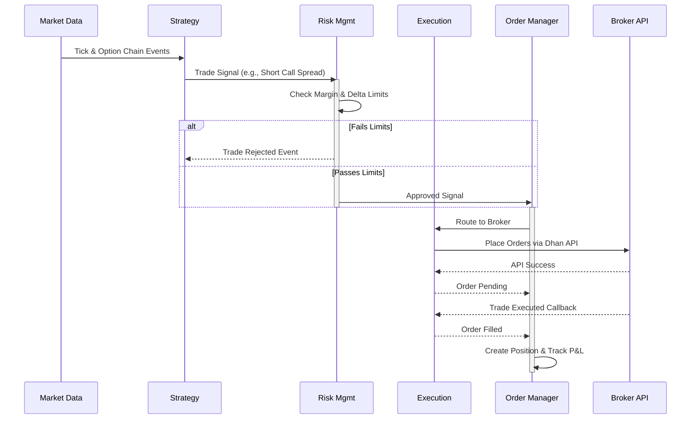

# NSE Options Trader: Agent Architecture

This document provides a detailed explanation of the multi-agent architecture powering the NSE Options Trader system. It uses a scalable, event-driven infrastructure orchestrated by LangGraph, where each agent is a specialist microservice communicating over a Redis event bus.

---

## High-Level Architecture Flow

```mermaid
graph TD
    classDef infra fill:#f9f,stroke:#333,stroke-width:2px;
    classDef agent fill:#bbf,stroke:#333,stroke-width:2px;
    
    Orch[Orchestrator Agent<br/>(LangGraph Coordinator)]:::agent
    
    subgraph "Data Acquisition & Processing"
        MD[Market Data Agent]:::agent
        GE[Greeks Engine Agent]:::agent
        FE[Feature Engineering]:::agent
        OFA[Order Flow Analysis]:::agent
    end
    
    subgraph "Intelligence & Prediction"
        MR[Market Regime Agent]:::agent
        SA[Strategy Agent<br/>(Gemini LLM)]:::agent
    end
    
    subgraph "Risk & Execution"
        RM[Risk Management Agent]:::agent
        HA[Hedging Agent]:::agent
        OM[Order Manager Agent]:::agent
        EX[Execution Agent]:::agent
    end
    
    subgraph "Monitoring"
        AN[Analytics Agent]:::agent
    end

    RedisBus((Redis Event Bus)):::infra

    Orch -->|Lifecycle & Schedule| RedisBus
    
    MD -->|Tick Data / Option Chains| RedisBus
    RedisBus -->|Raw Data| GE
    RedisBus -->|Raw Data| FE
    RedisBus -->|Raw Data| OFA

    GE -->|Greeks (Delta, Vega, IV)| RedisBus
    FE -->|Technical Features| RedisBus
    OFA -->|Order Flow Dynamics| RedisBus

    RedisBus -->|Features| MR
    MR -->|Regime (Trending/Volatile)| RedisBus
    
    RedisBus -->|Combined State| SA
    SA -->|Trade Signals| RedisBus
    
    RedisBus -->|Signals| RM
    RM -->|Approved/Rejected Trades| RedisBus
    
    RedisBus -->|Approved Trades| HA
    HA -->|Hedged Orders| RedisBus
    
    RedisBus -->|Hedged Orders| OM
    OM -->|Route to Broker| EX
    EX -->|Status/Fills| OM
    
    OM -->|Fills / P&L Updates| RedisBus
    RedisBus -->|Positions| AN
```

---

## Detailed Agent Descriptions

### 1. Orchestrator Agent
The orchestrator is the central nervous system. It does not trade directly, but manages the lifecycle and schedule of all other agents.
- **Responsibilities**:
  - Starts up and monitors all specialized agents.
  - Controls the market timeframe (Pre-Market 08:45, Open 09:15, Close 15:30 IST, and End of Day reports).
  - Handles the `PAPER` vs `LIVE` trading modes.
  - Automatically restarts failed agents with exponential back-off.

### 2. Market Data Agent
Acts as the entry point for all raw financial data into the system.
- **Responsibilities**:
  - Connects to the **Dhan Broker WebSocket** to stream real-time price ticks for NIFTY and BANKNIFTY.
  - Periodically fetches full option chains (call and put prices across strikes).
  - Normalizes payloads and publishes `TICK` and `OPTION_CHAIN` events to the event bus.

### 3. Greeks Engine Agent
The quantitative math engine of the system.
- **Responsibilities**:
  - Subscribes to tick data and option chains.
  - Computes the Black-Scholes Greeks (`Delta`, `Gamma`, `Theta`, `Vega`, `Rho`).
  - Estimates the Implied Volatility (IV) for each option contract.
  - Computes IV Rank and IV Percentile.

### 4. Feature Engineering Agent
Processes raw ticks into actionable trading indicators.
- **Responsibilities**:
  - Maintains a sliding window of historical prices.
  - Computes moving averages (SMA, EMA), Bollinger Bands, MACD, and RSI.
  - Publishes technical indicator snapshots over the bus for the Strategy agent to consume.

### 5. Order Flow Analysis Agent
Examines micro-structure and momentum.
- **Responsibilities**:
  - Analyzes trade volumes and depth-of-market (DOM) changes.
  - Identifies accumulation or distribution patterns.
  - Flags iceberg orders or institutional swept blocks.

### 6. Market Regime Agent
Detects the macroscopic state of the market.
- **Responsibilities**:
  - Predicts if the market is trending up/down, mean-reverting, or highly volatile.
  - Allows strategy selection algorithms to know *which* strategy to turn on (e.g. Iron Condors in ranging markets, Straddles in high vol).

### 7. Strategy Agent (LangGraph & Google Gemini)
The true "brain" of the quantitative system.
- **Responsibilities**:
  - Integrates inputs from the Greeks, Features, Regime, and Order Flow agents.
  - Utilizes **Google Gemini 1.5 Pro** via LangGraph to validate complex technical setups.
  - Generates discrete trade signals (e.g., *Deploy Iron Condor at specific strikes*).

### 8. Risk Management Agent
The uncompromising hardware-style gate for capital preservation.
- **Responsibilities**:
  - Hard-blocks any trade signals that exceed maximum daily loss (circuit breaker).
  - Enforces portfolio Delta and Vega limits (e.g., caps aggregate Delta to prevent directional blowups).
  - Verifies margin requirements before allowing the order to pass to the Order Manager.

### 9. Hedging Agent
Dynamically maintains portfolio neutrality.
- **Responsibilities**:
  - Monitors the aggregate portfolio Greeks.
  - If portfolio Delta drifts beyond a configured threshold, this agent automatically fires off offsetting signals (e.g., buying a fractional future or a particular option) to flatten the Delta.

### 10. Order Manager Agent
The state tracker for all executions.
- **Responsibilities**:
  - Maintains the canonical state of all open orders, partial fills, and active positions.
  - Calculates real-time running P&L (Profit and Loss).
  - Determines when to square off a position by stop-loss or take-profit logic.

### 11. Execution Agent
The adapter connecting the internal system to the external broker.
- **Responsibilities**:
  - Wraps the Dhan API (`dhanhq` SDK).
  - Converts internal system orders (Buy, Sell, Limit, Market) into live API calls.
  - Tracks order callbacks (Pending, Executed, Rejected) and translates them back to standard internal events.

### 12. Analytics Agent
The reporting and alert engine.
- **Responsibilities**:
  - Consumes P&L ticks and trade executions.
  - Generates End-of-Day (EOD) HTML/PDF tear-sheets on strategy performance.
  - Pushes critical notifications to the user via Telegram (e.g., "Stop-loss hit", "Circuit Breaker Tripped").

---

## Agent Interaction: Trade Lifecycle Sequence


